  

   

  

    <b>🌍 Sostenibilidad y Salud Laboral desde la Perspectiva IT 🛡️</b>
  

  
  
  

---

## 🎯 Nuestro Propósito

Bienvenidos a este repositorio central (*Hub*). Este espacio colaborativo es el resultado de una importante investigación cruzada cuyo objetivo es debatir dos mundos esenciales (y a menudo olvidados) dentro del sector tecnológico contemporáneo:

1. **La huella que dejamos en el medio ambiente:** *E-waste*, consumo de los enormes data centers y alternativas sostenibles reales.
2. **La huella que el trabajo deja en nosotros mismos:** Prevención de lesiones físicas y protección psicosocial contra el síndrome de *Burnout*.

---

## 🗂️ Estructura del Proyecto

A continuación, explora nuestros subproyectos accediendo mediante un solo clic a sus propios módulos independientes:

| Subproyecto | Descripción / Resumen Temático |
| :--- | :--- |
| **🌿 [Informática Ambiental](./informatica-ambiental/README.md)** | Análisis técnico sobre componentes, contaminación del silicio, leyes anti-obsolescencia y *Green Computing*. |
| **🛡️ [Seguridad y Salud IT](./seguridad-trabajo-informatica/README.md)** | Prevención de lesiones ergonómicas (Túnel carpiano, oculares), pausas activas y mobiliario homologado. |

---

## 👥 Autores y Desarrolladores

Documentado íntegramente de manera conjunta. Puedes ver nuestro trabajo y otros repositorios a través de GitHub:

  
| 👨‍💻 **David López** | 💻 **Sebas Sabido** |
| :---: | :---: |
| [@davidlpizano](https://github.com/davidlpizano) | [@sebasabido](https://github.com/sebasabido) |

 

> *Desarrollado con dedicación por un entorno informático más limpio y saludable.*
