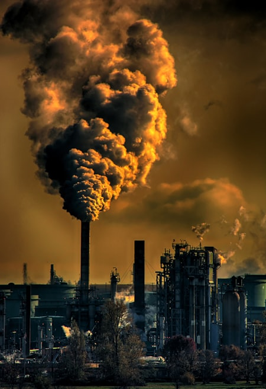
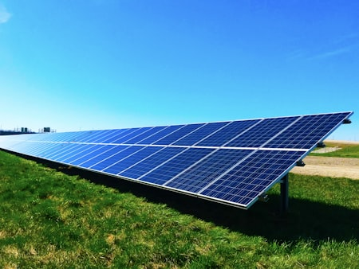
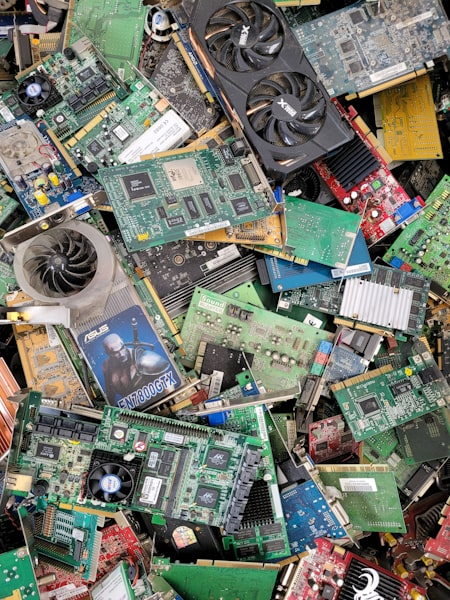

  

## 📑 Índice

1. [¿Qué es la contaminación ambiental?](#-qué-es-la-contaminación-ambiental)
2. [Residuos informáticos (E-waste)](#-residuos-informáticos-e-waste)
3. [Obsolescencia Programada](#-obsolescencia-programada)
4. [Informática Ecológica (Green Computing)](#-informática-ecológica)
5. [Autores y Código](#-autores)
6. [Referencias](#-referencias)

---

  
✨ <b>Funcionalidad Especial de Markdown (Clic aquí)</b>

  
En este repositorio se implementan banners visuales dinámicos interactuando con la <b>API web de Capsule Render (HTML embebido)</b>, la etiqueta html <code>&lt;details&gt;</code> para colapsar esta capa, y <b>notas al pie de página (footnotes)</b> nativas de Markdown con la sintaxis <code>[^1]</code>.

---

### 🌪️ ¿Qué es la contaminación ambiental?

Entendemos por contaminación ambiental la introducción de sustancias o formas de energía nocivas en un ecosistema natural. En el ámbito informático, este concepto se traduce directamente en las toneladas de Gases de Efecto Invernadero liberados a la capa de ozono por culpa del masivo consumo de la red eléctrica, la cual exige abastecer los enormes Centros de Datos que construyen nuestra internet global.

  
  

### 🗑️ Residuos informáticos (E-waste)

Comprendido como Desechos Electrónicos. Hoy mismo es el tipo de residuo manufacturado de más rápido crecimiento en el mundo. Tablets, pantallas, circuitos base y baterías que terminan en contenedores o abandonadas a la intemperie de países en vías de desarrollo. Estos equipos albergan una preocupante carga tóxica de mercurio, litio o cadmio capaz de filtrar la tierra subterránea ensuciando las vías fluviales.

  

### ⏳ Obsolescencia Programada

Se refiere al planeamiento intencionado por fabricantes de un equipo. Esto significa dotar sus componentes informáticos (software y hardware) con una fecha de caducidad encubierta y limitante. En resumen, su objetivo es hacer que una pieza como un smartphone, falle de imprevisto y de manera irreparable, coaccionando y orillando al consumidor a pagar por nuevos modelos anuales.

  

### ♻️ Informática Ecológica

El *Green Computing* es la respuesta del sector ético a la grave crisis contaminante. Persigue crear equipos longevos, altamente reparables y fabricados de materiales 100% reciclabes. Esto exige micro-arquitecturas de componentes que funcionen al mejor rendimiento pero exigiendo el pico más bajo de gasto energético; es la base de la sustentabilidad digital.

---

  
  

- **Sebas Sabido**

---

  
  

- [Organización Greenpeace: Artículos sobre la basura electrónica](https://es.greenpeace.org/)
- [Fundación FENISS - Lucha pro-ética contra la Obsolescencia Programada](https://feniss.org/)

---
 Perfil en GitHub: [@sebasabido](https://github.com/sebasabido).
