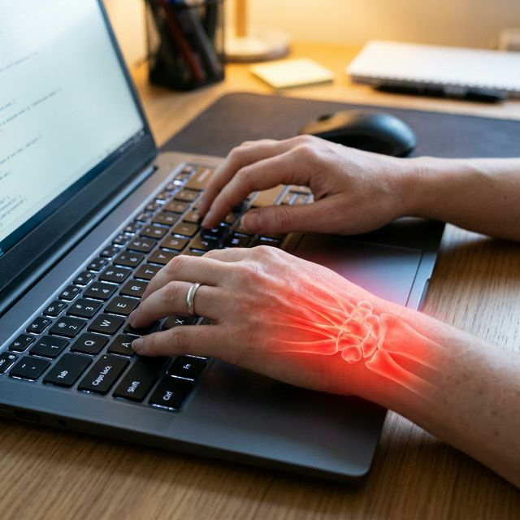

  

## 📑 Índice

1. [Riesgos Laborales (Perspectiva Informática)](#-riesgos-laborales-perspectiva-informática)
   - [Trastornos Físicos](#1-trastornos-físicos)
   - [Riesgos Psicosociales](#2-riesgos-psicosociales)
2. [Prevención de Riesgos](#-prevención-de-riesgos)
   - [Ergonomía Correcta](#1-ergonomía-correcta)
   - [Higiene Postural y Visual](#2-higiene-postural-y-visual)
3. [Autores y Código](#-autores)
4. [Referencias](#-referencias)

---

### ⚠️ Riesgos Laborales (Perspectiva Informática)

Todavía sobrevive la creencia de que sentarse tras un pupitre o programar al ordenador está exento al padecimiento físico y de baja médica. La repetitividad mecánica durante un maratón de jornadas prolongadas a oscuras daña el cuerpo de diversas maneras.

#### 1. Trastornos Físicos

De entre los estragos anatómicos más habituales de un trabajador del sector TI, solemos lidiar con el inflamado **Síndrome del Túnel Carpiano** (por pinzamiento de la muñeca tecleando y con el ratón). Además acarreamos pinzamientos cervicales agudos, problemas cardiovasculares de sedentarismo perpetuo, o síndrome del "ojo seco" (fatiga muscular ciliar aguda).

  
  

#### 2. Riesgos Psicosociales

Es una variante destructiva en donde el individuo entra en crisis total. La elevada presión mental, el lidiar con vulnerabilidades críticas en la red o un listado imparable de tickets provoca **Tecnoestrés**, un estado psicológico donde prevalece una irritabilidad total por sentirse superado, desatando la aparición del temido "*Burnout*" (Trabajador y empleado quemado).

---

### 🛡️ Prevención de Riesgos

En el informático, todos y cada uno de los riesgos crónicos previos pueden detenerse fácilmente cumpliendo pautas del campo de la Ergonomía laboral recomendadas por los organismos pertinentes.

#### 1. Ergonomía Correcta

Comprende la adquisición estricta y correcta de un equipo homologado; concretamente hablamos de asientos contables con amortiguación y soportes laterales al tren lumbar. La altura y rotación del monitor debe configurarse de este modo: La arista superior del panel de LEDs tiene que coincidir en un eje horizontal matemáticamente con la altura visual inicial del trabajador con la columna neutra y estirada.

  
  

#### 2. Higiene Postural y Visual

- **Famosa regla del 20-20-20:** Por cada veinte minutos seguidos expuesto intensivamente al monitor emitiendo luz azul sin enfocar de lejos; tenemos que pararnos estrictamente un lapidó de veinte segundos, divisando un paisaje o un espacio al menos algo mayor a veinte pies (aprox. 6 metros).

##### ⚖️ Cuadro de Impacto Según Hábitos

| Situación Base | Intervención Aplicada | ¿Realiza Pausa Activa? | 🎯 Resultado Final en el Técnico |
| :--- | :--- | :--- | :--- |
| ⚠️ Mala postura | ❌ Ninguna (Mobiliario estándar) | ❌ **No** (Pantalla continua) | 💥 Agotamiento, túnel carpiano y *burnout*. |
| ⚠️ Mala postura | 🪑 **Ajuste Ergonómico** general | ❌ **No** (Pantalla continua) | ⚠️ Tensión progresiva y fatiga acumulativa. |
| ⚠️ Mala postura | 🪑 **Ajuste Ergonómico** general | ✅ **Sí** (Descansos 20-20-20) | 🌟 **Calidad de vida y productividad óptima.** |

---

  
  

- **David López**

---

  
  

- [Instituto de Seguridad y Salud (INSST) - Uso Seguro y de Calidad con las Pantallas (PVD)](https://www.insst.es/)
- [Guía de Higiene y Buenas Prácticas Informáticas](https://www.who.int/)

---
